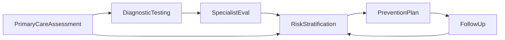

# Cardiovascular disease prevention and assessment workflow

This page describes the **clinical and programme pathway** for Lithuanian **CVD prevention and early diagnosis**, aligned with the national **risk assessment questionnaire** and **prevention measures plan** (including later **achievement evaluation**). It matches the high-level process model used for programme design: primary assessment → investigations → optional specialist review → integrated risk interpretation → prevention plan → longitudinal follow-up.

FHIR resources from **this IG** appear mainly from step 4 onward (risk and plan); earlier steps rely heavily on **LT Base**, **LT VitalSigns**, **LT Lab**, and **LT Lifestyle** for demographics, vitals, labs, and behavioural data.

## 1. Primary care assessment and data collection

The pathway starts with a **primary care CVD assessment visit** (patient present). The general practitioner or nurse collects **cardiovascular history and risk factors**, records **vital signs and anthropometrics** (e.g. blood pressure, heart rate, BMI, waist circumference), and may initiate **risk estimation** using an appropriate model (e.g. SCORE2 / SCORE2-OP). An ECG may be performed when indicated.

* **Context:** Patient, practitioner, organisation, and encounter are typically represented with **LT Base** (and related) profiles.
* **Measurements:** Blood pressure, weight, height, BMI, etc. use **LT VitalSigns** (and general Observation patterns) where profiled there.
* **Lifestyle factors** (smoking, alcohol, activity, diet) often map to **LT Lifestyle** observations when captured in structured form.

This step supplies the **inputs** for formal risk documentation in step 4.

## 2. Diagnostic testing (data acquisition)

Based on the first assessment, **laboratory** tests (e.g. lipid profile, glucose or HbA1c, kidney function) and **functional or imaging** tests (e.g. echocardiography) may be performed. These produce **structured results** but are not, by themselves, programme “conclusions”—they feed **interpretation** and risk calculation.

* **Laboratory results** are usually **LT Lab** (or equivalent Observation) resources.
* Results are referenced conceptually when building the **CVD risk assessment** and **risk group** in the next steps.

## 3. Specialist evaluation (if applicable)

If indicated, the patient may attend **cardiology** or another specialist. The specialist reviews primary-care data and test results and may order **additional tests**.

This IG does not define a dedicated “referral” profile; **ServiceRequest** / **Encounter** patterns from Base or EU packages may apply. Outputs again feed **step 4**.

## 4. Clinical interpretation and risk stratification

Available data are integrated into a coherent **CVD assessment** for the programme:

* **[CVDRiskAssessmentLtCvd](StructureDefinition-cvd-risk-assessment-lt-cvd.html)** — structured **SCORE2-style** cardiovascular risk (percentage) and **qualitative risk degree** (bound value set).
* **[RiskGroupObservationLtCvd](StructureDefinition-risk-group-observation-lt-cvd.html)** — **programme risk group** for heart and vessel diseases (e.g. for recall and reporting), consistent with national criteria where automation or manual confirmation applies.
* **[CvdChronicConditionLtCvd](StructureDefinition-cvd-chronic-condition-lt-cvd.html)** — **accompanying chronic diseases** relevant to CVD risk from the programme list.
* **[RiskFactorStatusLtCvd](StructureDefinition-risk-factor-status-lt-cvd.html)** — **risk factors** (including total count where used).
* **[EKGLtCvd](StructureDefinition-ekg-lt-cvd.html)** — **ECG** when captured as part of this assessment context.

Together, these correspond to the **questionnaire** sections for chronic diseases, risk factors, objective findings, ECG, and risk group, plus the numeric risk estimate.

## 5. Prevention and management planning

For patients assigned to an eligible **risk group**, a **CVD prevention measures plan** is created: lifestyle counselling (nutrition, physical activity, smoking cessation, healthy weight), **target LDL cholesterol** and **blood pressure**, and documentation of **regular use of prescribed medications** (antilipid, antihypertensive, etc.) as required by the programme forms.

* **[CarePlanLtCvd](StructureDefinition-care-plan-lt-cvd.html)** carries the structured plan. **[RiskGroupExtLtCvd](StructureDefinition-risk-group-ext-lt-cvd.html)** can repeat or align **risk group** on the plan when needed.
* Lifestyle extensions referenced from the plan may align with **LT Lifestyle** (e.g. physical activity, dietary notes).
* **MedicationStatement** resources (often base or lifestyle screening context) can represent **current medications** linked to the patient.

Example instances in this IG illustrate [care plans](CarePlan-care-plan-cvd-screening-example.html) and related observations.

## 6. Follow-up and achievement evaluation

CVD prevention is **longitudinal**. At follow-up visits (possibly at another institution or with another clinician), **achievement evaluation** is recorded: e.g. achieved LDL, current blood pressure, whether targets were met, smoking status, BMI, and evaluator comments.

* New **Observations** (vitals, labs) and updated **CarePlan** or **Goal**-related documentation represent this phase; the **same profile set** applies to **new instances over time**, not a separate “achievement” resource type.
* Programme indicators (e.g. participation in healthy lifestyle training) may appear as additional observations or questionnaire fields as national forms specify.

## Programme document bundle (CVD report + composition)

For a **single exchangeable record** that mirrors **pathology** and **imaging** reporting patterns in other Lithuanian IGs, this guide defines **[CvdReportLtCvd](StructureDefinition-cvd-report-lt-cvd.html)** and **[CvdCompositionLtCvd](StructureDefinition-cvd-composition-lt-cvd.html)**. The **DiagnosticReport** lists **Observation** results (SCORE2, risk group, EKG, follow-up LDL and BP); the **Composition** groups **assessment**, **prevention plan** (e.g. **CarePlan**), and **achievement evaluation** with **section narratives** and **entry** references. See **[CVD programme report](cvd-report.html)** for the full pattern and **[example instances](DiagnosticReport-diagnosticreport-cvd-example.html)**.

**Illustrative examples** on the FHIR CI build for **vitals** and **lifestyle** data that feed assessment include: [blood pressure](https://build.fhir.org/ig/HL7LT/ig-lt-vitalsigns/Observation-observation-blood-pressure-example.html), [body height](https://build.fhir.org/ig/HL7LT/ig-lt-vitalsigns/Observation-observation-body-height-example.html), [tobacco use](https://build.fhir.org/ig/HL7LT/ig-lt-lifestyle/Observation-observation-tobacco-use-current-smoker-example.html), and [alcohol consumption](https://build.fhir.org/ig/HL7LT/ig-lt-lifestyle/Observation-observation-alcohol-consumption-no-example.html) (LT VitalSigns and LT Lifestyle).

## ESPBI electronic forms (Questionnaire)

The national **risk assessment** and **prevention / achievement** forms can be represented as **[Questionnaire](https://hl7.org/fhir/questionnaire.html)** / **[QuestionnaireResponse](https://hl7.org/fhir/questionnaireresponse.html)** — independent of the **CvdReport** bundle. Illustrative definitions and examples are on **[Questionnaires](cvd-questionnaire.html)**.

## Overview diagram

The loop from **FollowUp** back to **RiskStratification** reflects **reassessment** and plan updates over time.

This workflow supports **standardised exchange** of questionnaire, plan, and follow-up data while keeping a clear separation between **raw measurements** (vitals, labs), **programme interpretation** (risk score, risk group), and **care planning** (this IG’s focus in steps 4–6).
