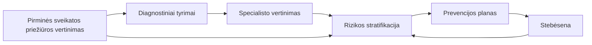

# Širdies ir kraujagyslių ligų prevencijos ir vertinimo darbo eiga

Šiame puslapyje aprašoma **klinikinė ir programinė eiga**, taikoma Lietuvos **ŠKL prevencijos ir ankstyvosios diagnostikos** kontekste, suderinta su nacionaliniu **rizikos vertinimo klausimynu** ir **prevencijos priemonių planu** (įskaitant vėlesnį **pasiekimų vertinimą**). Ji atitinka aukšto lygmens proceso modelį, naudojamą programai projektuoti: pirminis vertinimas → tyrimai → prireikus specialisto konsultacija → integruota rizikos interpretacija → prevencijos planas → ilgalaikė stebėsena.

FHIR ištekliai iš **šio IG** daugiausia pradedami naudoti nuo 4 žingsnio (rizika ir planas), o ankstesniuose žingsniuose daugiausia remiamasi **LT Base**, **LT VitalSigns**, **LT Lab** ir **LT Lifestyle** profiliais, skirtais demografiniams duomenims, gyvybiniams rodikliams, laboratoriniams tyrimams ir gyvensenos duomenims.

## 1. Pirminės sveikatos priežiūros vertinimas ir duomenų surinkimas

Procesas prasideda **pirminės sveikatos priežiūros ŠKL vertinimo vizitu**, kuriame dalyvauja pacientas. Šeimos gydytojas arba slaugytojas surenka **širdies ir kraujagyslių anamnezę bei rizikos veiksnius**, užfiksuoja **gyvybinius rodiklius ir antropometrinius duomenis** (pvz., kraujospūdį, širdies susitraukimų dažnį, KMI, liemens apimtį) ir prireikus pradeda **rizikos įvertinimą** naudodamas tinkamą modelį (pvz., SCORE2 / SCORE2-OP). Esant indikacijoms gali būti atliekama EKG.

* **Kontekstas:** pacientas, gydytojas, organizacija ir vizitas paprastai atvaizduojami naudojant **LT Base** (ir susijusius) profilius.
* **Matavimai:** kraujospūdis, svoris, ūgis, KMI ir kt. paprastai atvaizduojami naudojant **LT VitalSigns** (ir bendruosius `Observation` modelius), jei ten yra atitinkami profiliai.
* **Centrinis nutukimas** kaip rizikos veiksnys vertinamas pagal **liemens apimtį** (`WaistCircumference` iš LT VitalSigns; ribos: vyrams >= 102 cm, moterims >= 88 cm) ir registruojamas naudojant **[RiskFactorStatusLtCvd](StructureDefinition-risk-factor-status-lt-cvd.html)** su SNOMED kodu `248311001` (Central obesity).
* **Gyvensenos veiksniai** (rūkymas, alkoholio vartojimas, fizinis aktyvumas, mityba), jei fiksuojami struktūruotai, dažnai atvaizduojami per **LT Lifestyle** stebėjimo išteklius.

Šis žingsnis pateikia **įvesties duomenis** formaliam rizikos dokumentavimui 4 žingsnyje.

## 2. Diagnostiniai tyrimai (duomenų surinkimas)

Remiantis pirminiu vertinimu, gali būti atliekami **laboratoriniai** tyrimai ir **funkciniai arba vaizdiniai** tyrimai. Jie sukuria **struktūrizuotus rezultatus**, tačiau savaime dar nėra programos „išvados“ — šie duomenys naudojami **interpretacijai** ir rizikos apskaičiavimui.

* **Pirminėje sveikatos priežiūroje atliekami laboratoriniai tyrimai** naudoja **LT Lab** profilius: lipidograma ([TotalCholesterolLabLt](https://build.fhir.org/ig/HL7LT/ig-lt-lab/StructureDefinition-total-cholesterol-lab-lt.html), [CholesterolHdlLabLt](https://build.fhir.org/ig/HL7LT/ig-lt-lab/StructureDefinition-cholesterol-hdl-lab-lt.html), [CholesterolLdlLabLt](https://build.fhir.org/ig/HL7LT/ig-lt-lab/StructureDefinition-cholesterol-ldl-lab-lt.html), [TriglyceridesLabLt](https://build.fhir.org/ig/HL7LT/ig-lt-lab/StructureDefinition-triglycerides-lab-lt.html)), gliukozė ([GlucoseVenousLabLt](https://build.fhir.org/ig/HL7LT/ig-lt-lab/StructureDefinition-glucose-venous-lab-lt.html)), HbA1c ([HbA1cLabLt](https://build.fhir.org/ig/HL7LT/ig-lt-lab/StructureDefinition-hba1c-lab-lt.html)), kreatininas, eGFR ir albumino / kreatinino santykis.
* **Kardiologo skiriami laboratoriniai tyrimai** taip pat naudoja **LT Lab** profilius: [ApolipoproteinBLabLt](https://build.fhir.org/ig/HL7LT/ig-lt-lab/StructureDefinition-apolipoprotein-b-lab-lt.html) (Apo B), [LipoproteinALabLt](https://build.fhir.org/ig/HL7LT/ig-lt-lab/StructureDefinition-lipoprotein-a-lab-lt.html) (Lp(a) — masės ir molinis metodai), [PotassiumLabLt](https://build.fhir.org/ig/HL7LT/ig-lt-lab/StructureDefinition-potassium-lab-lt.html) (K+), [ASTLabLt](https://build.fhir.org/ig/HL7LT/ig-lt-lab/StructureDefinition-ast-lab-lt.html) (GOT), [ALTLabLt](https://build.fhir.org/ig/HL7LT/ig-lt-lab/StructureDefinition-alt-lab-lt.html) (GPT) ir [HsCRPLabLt](https://build.fhir.org/ig/HL7LT/ig-lt-lab/StructureDefinition-hs-crp-lab-lt.html) (didelio jautrumo CRB ŠKL rizikai vertinti).
* Šie rezultatai konceptualiai naudojami kuriant **ŠKL rizikos vertinimą** ir **rizikos grupę** tolesniuose žingsniuose.

## 3. Specialisto vertinimas (jei taikoma)

Esant indikacijoms (pvz., nustačius didelę ar labai didelę SCORE2 riziką), pacientas gali būti nukreipiamas **kardiologo** ar kito specialisto konsultacijai. Specialistas peržiūri pirminės priežiūros duomenis ir tyrimų rezultatus bei prireikus skiria **papildomus diagnostinius tyrimus**, kurie šiame IG atvaizduojami taip:

* **[EKGLtCvd](StructureDefinition-ekg-lt-cvd.html)** — 12 derivacijų EKG su `SampledData` signalo duomenimis ir išsamia interpretacija (normali, patologinė, ST-T pokyčiai, prieširdžių virpėjimas / plazdėjimas, kairiosios Hiso pluošto kojytės blokada, supraventrikulinė aritmija, ekstrasistolija). Laisvo teksto „Kita“ radiniai pateikiami `Observation.note`.
* **[EchocardiographyLtCvd](StructureDefinition-echocardiography-lt-cvd.html)** — širdies echoskopija, apimanti išstūmio frakciją (%), EF kategoriją (išsaugota >= 50 %, nežymiai sumažėjusi 41–49 %, sumažėjusi <= 40 %) ir neprivalomą patologiją (TLK-10).
* **[ArterialStiffnessLtCvd](StructureDefinition-arterial-stiffness-lt-cvd.html)** — pulsinės bangos greitis (PWV) tarp miego ir šlauninės arterijų, m/s; norma < 10 m/s.
* **[CarotidUltrasoundLtCvd](StructureDefinition-carotid-ultrasound-lt-cvd.html)** — miego arterijų echoskopija su dešinės / kairės pusės plokštelių kategorijomis (nėra, yra, < 50 %, 50–69 %, > 70 %) ir intimos-medijos storiu (IMT; patologinis > 1,5 mm).
* **[AnkleBrachialIndexLtCvd](StructureDefinition-ankle-brachial-index-lt-cvd.html)** — kulkšnies ir žasto indeksas (ABI), taikomas pacientams, sergantiems cukriniu diabetu, ir rūkantiems; pateikiamos dešinės / kairės pusės reikšmės ir periferinių arterijų ligos sunkumo kategorija (norma > 0,9, lengva / vidutinė 0,41–0,90, sunki <= 0,40).
* **[CoronaryCalciumScoreLtCvd](StructureDefinition-coronary-calcium-score-lt-cvd.html)** — vainikinių arterijų kalcio Agatstono indeksas su 6 lygių interpretacija (nuo 0 iki > 1000). Skiriamas, kai neaišku, ar reikalingas medikamentinis gydymas, arba kai statinai netoleruojami.

Šiame IG atskiro „siuntimo“ profilio nėra apibrėžta; gali būti taikomi **ServiceRequest** / **Encounter** modeliai iš Base ar Europos paketų. Šio etapo rezultatai naudojami **4 žingsnyje**.

## 4. Klinikinė interpretacija ir rizikos stratifikacija

Turimi duomenys sujungiami į nuoseklų programinį **ŠKL vertinimą**:

* **[CVDRiskAssessmentLtCvd](StructureDefinition-cvd-risk-assessment-lt-cvd.html)** — struktūrizuota **SCORE2 tipo** širdies ir kraujagyslių rizika (procentais) ir **kokybinė rizikos kategorija**.
* **[RiskGroupObservationLtCvd](StructureDefinition-risk-group-observation-lt-cvd.html)** — **programos rizikos grupė** širdies ir kraujagyslių ligoms (pvz., pacientų kvietimui ir ataskaitoms), nustatoma pagal nacionalinius kriterijus automatizuotai arba patvirtinama rankiniu būdu.
* **[CvdChronicConditionLtCvd](StructureDefinition-cvd-chronic-condition-lt-cvd.html)** — **gretutinės lėtinės ligos**, reikšmingos ŠKL rizikai pagal programos sąrašą.
* **[RiskFactorStatusLtCvd](StructureDefinition-risk-factor-status-lt-cvd.html)** — **rizikos veiksniai** (įskaitant bendrą jų skaičių, jei taikoma).
* **[EKGLtCvd](StructureDefinition-ekg-lt-cvd.html)** — **EKG**, kai ji fiksuojama šio vertinimo kontekste (palaikomi išsamūs radiniai: ST-T pokyčiai, aritmijos, laidumo sutrikimai).
* **Širdies ir kraujagyslių diagnostiniai tyrimai** (kai atliekami specialisto vertinimo metu): [EchocardiographyLtCvd](StructureDefinition-echocardiography-lt-cvd.html), [ArterialStiffnessLtCvd](StructureDefinition-arterial-stiffness-lt-cvd.html), [CarotidUltrasoundLtCvd](StructureDefinition-carotid-ultrasound-lt-cvd.html), [AnkleBrachialIndexLtCvd](StructureDefinition-ankle-brachial-index-lt-cvd.html), [CoronaryCalciumScoreLtCvd](StructureDefinition-coronary-calcium-score-lt-cvd.html).

Kartu šie duomenys atitinka **klausimyno** skiltis apie lėtines ligas, rizikos veiksnius, objektyvius duomenis, EKG ir rizikos grupę, taip pat skaitinį rizikos įvertį.

## 5. Prevencijos ir valdymo planavimas

Pacientams, priskirtiems atitinkamai **rizikos grupei**, sudaromas **ŠKL prevencijos priemonių planas**: gyvensenos konsultacijos (mityba, fizinis aktyvumas, rūkymo nutraukimas, sveikas kūno svoris), **tikslinė MTL cholesterolio reikšmė** ir **tikslinis arterinis kraujospūdis**, taip pat **reguliaraus paskirtų vaistų vartojimo** dokumentavimas pagal programos formas.

* **[CarePlanLtCvd](StructureDefinition-care-plan-lt-cvd.html)** naudojamas struktūrizuotam planui pateikti. **[RiskGroupExtLtCvd](StructureDefinition-risk-group-ext-lt-cvd.html)** prireikus leidžia plane pakartoti arba suderinti **rizikos grupę**.
* Su planu susiję gyvensenos plėtiniai gali būti derinami su **LT Lifestyle** (pvz., fizinio aktyvumo ar mitybos pastabos).
* **MedicationStatement** ištekliai (dažnai iš bazinio arba gyvensenos patikros konteksto) gali būti naudojami **šiuo metu vartojamiems vaistams** atvaizduoti.

Šio IG pavyzdžiai iliustruoja [priežiūros planus](CarePlan-care-plan-cvd-screening-example.html) ir susijusius stebėjimo išteklius.

## 6. Stebėsena ir pasiekimų vertinimas

ŠKL prevencija yra **ilgalaikis procesas**. Pakartotinių vizitų metu (galbūt kitoje įstaigoje ar pas kitą specialistą) registruojamas **pasiekimų vertinimas**: pvz., pasiekta MTL reikšmė, dabartinis kraujospūdis, ar pasiekti tikslai, rūkymo būsena, KMI ir vertintojo komentarai.

* Nauji **Observation** ištekliai (gyvybiniai rodikliai, laboratoriniai tyrimai) ir atnaujintas **CarePlan** ar su **Goal** susijęs dokumentavimas atspindi šį etapą; taikomas **tas pats profilių rinkinys**, kuriant **naujus egzempliorius laikui bėgant**, o ne atskiras „pasiekimų“ išteklių tipas.
* Programos rodikliai (pvz., dalyvavimas sveikos gyvensenos mokymuose) gali būti pateikiami kaip papildomi stebėjimo ištekliai arba klausimyno laukai, kaip nurodyta nacionalinėse formose.

## Programos dokumentų rinkinys (ŠKL ataskaita + kompozicija)

Siekiant suformuoti **vieną keičiamą įrašą**, atitinkantį **patologijos** ir **vaizdinės diagnostikos** ataskaitų modelius kituose Lietuvos IG, šiame vadove apibrėžiami **[CvdReportLtCvd](StructureDefinition-cvd-report-lt-cvd.html)** ir **[CvdCompositionLtCvd](StructureDefinition-cvd-composition-lt-cvd.html)**. **DiagnosticReport** pateikia **Observation** rezultatus (SCORE2, rizikos grupę, EKG, stebėsenos MTL ir AKS), o **Composition** sugrupuoja **vertinimą**, **prevencijos planą** (pvz., **CarePlan**) ir **pasiekimų vertinimą**, naudodama **skyrių naratyvus** ir **`entry`** nuorodas. Visas modelis pateiktas puslapyje **[ŠKL programos ataskaita](cvd-report.html)**, o pavyzdžiai — **[čia](DiagnosticReport-diagnosticreport-cvd-example.html)**.

**Pavyzdžiai** FHIR CI Build aplinkoje, iliustruojantys **gyvybinių rodiklių** ir **gyvensenos** duomenis, naudojamus vertinimui, apima: [arterinį kraujospūdį](https://build.fhir.org/ig/HL7LT/ig-lt-vitalsigns/Observation-observation-blood-pressure-example.html), [kūno ūgį](https://build.fhir.org/ig/HL7LT/ig-lt-vitalsigns/Observation-observation-body-height-example.html), [tabako vartojimą](https://build.fhir.org/ig/HL7LT/ig-lt-lifestyle/Observation-observation-tobacco-use-current-smoker-example.html) ir [alkoholio vartojimą](https://build.fhir.org/ig/HL7LT/ig-lt-lifestyle/Observation-observation-alcohol-consumption-no-example.html) (LT VitalSigns ir LT Lifestyle).

## ESPBI elektroninės formos (Questionnaire)

Nacionalinės **rizikos vertinimo** ir **prevencijos / pasiekimų vertinimo** formos gali būti atvaizduojamos kaip **[Questionnaire](https://hl7.org/fhir/questionnaire.html)** / **[QuestionnaireResponse](https://hl7.org/fhir/questionnaireresponse.html)** nepriklausomai nuo **CvdReport** rinkinio. Pavyzdiniai aprašai ir pavyzdžiai pateikti puslapyje **[Klausimynai](questionnaires.html)**.

## Apžvalgos schema

Grįžtamoji rodyklė iš **Stebėsenos** į **Rizikos stratifikaciją** atspindi **pakartotinį vertinimą** ir plano atnaujinimą laikui bėgant.

Ši darbo eiga palaiko **standartizuotus klausimyno, plano ir stebėsenos duomenų mainus**, kartu aiškiai atskirdama **pirminius matavimus** (gyvybinius rodiklius, laboratorinius tyrimus), **programinę interpretaciją** (rizikos įvertį, rizikos grupę) ir **priežiūros planavimą** (pagrindinį šio IG dėmesį 4–6 žingsniuose).

## DSTU1 į R5 migracijos pastabos

Ankstesnė ESPBI sistema naudoja tris DSTU1 Atom feed dokumentus (SKL01, SKL02, SKL03). Šiame skyriuje aprašomi struktūriniai pokyčiai, susiję su migracija į FHIR R5.

### Dokumentų tipai

| DSTU1 forma | LOINC kodas | R5 profilis |
|---|---|---|
| SKL01 — Rizikos vertinimo klausimynas | `83539-7` | [CvdRiskAssessmentCompositionLtCvd](StructureDefinition-cvd-risk-assessment-composition-lt-cvd.html) |
| SKL02 — Prevencijos planas | `77442-2` | [CvdPreventionPlanCompositionLtCvd](StructureDefinition-cvd-prevention-plan-composition-lt-cvd.html) |
| SKL03 — Pasiekimų vertinimas | `78710-1` | [CvdAchievementCompositionLtCvd](StructureDefinition-cvd-achievement-composition-lt-cvd.html) |

Sujungta [CvdCompositionLtCvd](StructureDefinition-cvd-composition-lt-cvd.html) kompozicija (LOINC `51848-0`) gali būti naudojama tuomet, kai visi trys skyriai pateikiami viename dokumente.

### Rizikos veiksnių struktūros pokyčiai

DSTU1 kiekvienas rizikos veiksnys (hipertenzija, dislipidemija ir kt.) pateikiamas kaip **dviejų `Observation` išteklių pora**:
1. Pagrindinis `Observation`, kuriame `method.coding` nurodo rizikos veiksnio tipą (pvz., SNOMED `38341003` hipertenzijai), o `valueCodeableConcept` iš `risk-probability` rinkinio (certain / negligible) nurodo buvimą.
2. Susijęs gydymo būsenos `Observation` (bendras keliems rizikos veiksniams per `<related>`), naudojantis SNOMED `1156601009`, o reikšmė nurodo gydymo būseną.

FHIR R5 kiekvienas rizikos veiksnys atvaizduojamas vienu [RiskFactorStatusLtCvd](StructureDefinition-risk-factor-status-lt-cvd.html) `Observation` ištekliumi su **komponentais**:
- `code` identifikuoja rizikos veiksnio tipą (pakeičia DSTU1 `method`)
- `component[risk]` pateikia rizikos tikimybę (pakeičia DSTU1 `valueCodeableConcept`)
- `component[treatment]` pateikia gydymo būseną (pakeičia DSTU1 susijusį `Observation`)
- `component[medication]` gali papildomai nurodyti konkretų vaistą

DSTU1 modelis, kuriame vienas gydymo `Observation` naudojamas keliems rizikos veiksniams, R5 pakeičiamas nepriklausomomis komponentų reikšmėmis kiekvienam rizikos veiksniui atskirai.

### Gyvensenos rizikos veiksniai

DSTU1 rūkymas, fizinis aktyvumas, mityba, alkoholio vartojimas ir šeiminė anamnezė koduojami kaip bendrieji rizikos veiksnių `Observation` ištekliai (kodas `80943009`), atskiriami pagal `method.coding` (e. sveikatos klasifikatorius). R5 jie atvaizduojami naudojant **specializuotus profilius** iš **LT Lifestyle IG** (pvz., `TobaccoUseLtLifestyle`, `PhysicalActivityLtLifestyle`, `NutritionLtLifestyle`).