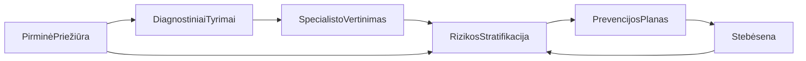

# Širdies ir kraujagyslių ligų prevencijos ir vertinimo darbo eiga

Šiame puslapyje aprašomas **klinikinis ir programos kelias** Lietuvos **ŠKL prevencijos ir ankstyvos diagnostikos** kontekste, suderintas su nacionaline **rizikos vertinimo anketa** ir **prevencijos priemonių planu** (įskaitant vėlesnį **pasiekimų vertinimą**). Jis atitinka aukšto lygio procesą: pirminė apžiūra → tyrimai → neprivaloma specialisto apžiūra → integruota rizikos interpretacija → prevencijos planas → ilgalaikė stebėsena.

FHIR resursai iš **šio IG** dažniausiai atsiranda nuo 4 žingsnio (rizika ir planas); ankstesni žingsniai remiasi **LT baze**, **LT gyvybiniais rodikliais**, **LT laboratorija** ir **LT gyvensena** demografijai, gyvybiniams rodikliams, laboratorijai ir elgsenai.

## 1. Pirminės priežiūros vertinimas ir duomenų rinkimas

Kelias prasideda **pirminės priežiūros ŠKL vertinimo vizitu** (pacientas dalyvauja). Šeimos gydytojas ar slaugytojas renka **širdies ir kraujagyslių anamnezę ir rizikos veiksnius**, fiksuoja **gyvybinius ir antropometrinius rodiklius** (kraujospūdis, pulsas, KMI, juosmens apimtis) ir gali pradėti **rizikos įvertinimą** pagal modelį (pvz., SCORE2 / SCORE2-OP). Esant indikacijai atliekamas EKG.

* **Kontekstas:** Pacientas, specialistas, organizacija ir vizitas dažniausiai — **LT bazė** (ir susiję profiliai).
* **Matavimai:** Kraujospūdis, svoris, ūgis, KMI ir kt. — **LT gyvybiniai rodikliai** (ir bendri Observation šablonai).
* **Gyvensenos veiksniai** (rūkymas, alkoholis, aktyvumas, mityba) struktūrizuotai dažnai — **LT gyvensena**.

Šis žingsnis paruošia **įvestis** formaliam rizikos dokumentavimui 4 žingsnyje.

## 2. Diagnostiniai tyrimai (duomenų įsigijimas)

Pagal pirmą vertinimą gali būti atliekami **laboratoriniai** tyrimai (lipidų profilis, gliukozė ar HbA1c, inkstų funkcija) ir **funkciniai ar vaizdiniai** (pvz., echokardiografija). Gaunami **struktūrizuoti rezultatai** — tai ne programos „išvados“ savaime, o **interpretacijos** ir rizikos skaičiavimo įvestis.

* **Laboratoriniai rezultatai** paprastai — **LT laboratorija** (ar ekvivalentūs Observation).
* Rezultatai konceptualiai naudojami kuriant **ŠKL rizikos vertinimą** ir **rizikos grupę** vėlesniuose žingsniuose.

## 3. Specialisto vertinimas (jei indikuojama)

Esant indikacijai pacientas gali kreiptis į **kardiologiją** ar kitą specialybę. Specialistas peržiūri pirminės priežiūros duomenis ir tyrimų rezultatus, gali užsakyti **papildomus tyrimus**.

Šis IG neapibrėžia atskiros „siuntimo“ profilio; gali tikti **ServiceRequest** / **Encounter** šablonai iš bazės ar ES paketų. Išvestys vėl patenka į **4 žingsnį**.

## 4. Klinikinė interpretacija ir rizikos stratifikacija

Prieinami duomenys integruojami į **ŠKL vertinimą** programai:

* **[CVDRiskAssessmentLtCvd](StructureDefinition-cvd-risk-assessment-lt-cvd.html)** — struktūrizuota **SCORE2 tipo** širdies ir kraujagyslių rizika (procentais) ir **kokybinė rizikos pakopa**.
* **[RiskGroupObservationLtCvd](StructureDefinition-risk-group-observation-lt-cvd.html)** — **programos rizikos grupė** širdies ir kraujagyslių ligoms (pvz., priminimams ir ataskaitoms), pagal nacionalinius kriterijus automatizuotai ar rankiniu patvirtinimu.
* **[CvdChronicConditionLtCvd](StructureDefinition-cvd-chronic-condition-lt-cvd.html)** — **lydinčios lėtinės ligos** iš programos sąrašo.
* **[RiskFactorStatusLtCvd](StructureDefinition-risk-factor-status-lt-cvd.html)** — **rizikos veiksniai** (įskaitant bendrą skaičių, jei naudojamas).
* **[EKGLtCvd](StructureDefinition-ekg-lt-cvd.html)** — **EKG** šiame vertinimo kontekste.

Kartu tai atitinka anketos skiltis: lėtinės ligos, rizikos veiksniai, objektyvi būklė, EKG ir rizikos grupė, taip pat skaitinį rizikos įvertinimą.

## 5. Prevencijos ir valdymo planavimas

Pacientams, priskirtiems tinkamai **rizikos grupei**, kuriamas **ŠKL prevencijos priemonių planas**: gyvensenos konsultacijos (mityba, fizinis aktyvumas, metimas rūkyti, sveikas svoris), **MTL cholesterolio** ir **arterinio kraujospūdžio** tikslai, **nuolatinio paskirtų vaistų vartojimo** dokumentavimas pagal programos formas.

* **[CarePlanLtCvd](StructureDefinition-care-plan-lt-cvd.html)** neša struktūrizuotą planą. **[RiskGroupExtLtCvd](StructureDefinition-risk-group-ext-lt-cvd.html)** gali pakartoti ar suderinti **rizikos grupę** plane.
* Iš plano nurodomi gyvensenos plėtiniai gali sutapti su **LT gyvensena** (pvz., fizinis aktyvumas, mitybos pastabos).
* **MedicationStatement** resursai gali atspindėti **dabartinius vaistus**.

Šio IG pavyzdžiai iliustruoja [priežiūros planus](CarePlan-care-plan-cvd-screening-example.html) ir susijusius stebėjimus.

## 6. Stebėsena ir pasiekimų vertinimas

ŠKL prevencija yra **ilgalaikė**. Pakartotinių vizitų metu (galbūt kitoje įstaigoje ar pas kitą gydytoją) fiksuojamas **pasiekimų vertinimas**: pasiektas MTL, dabartinis kraujospūdis, ar pasiekti tikslai, rūkymo būsena, KMI, vertintojo komentarai.

* Nauji **Observation** (gyvybiniai, laboratorija) ir atnaujintas **CarePlan** ar su tikslais susijęs dokumentavimas vaizduoja šią fazę; taikomas **tas pats profilių rinkinys** kaip **nauji egzemplioriai laike**, ne atskiras „pasiekimų“ resursų tipas.
* Programos rodikliai (pvz., dalyvavimas sveikos gyvensenos mokymuose) gali būti papildomi stebėjimai ar laukai pagal nacionalines formas.

## Apžvalgos schema

Kilpa iš **Stebėsena** atgal į **RizikosStratifikacija** atspindi **pakartotinį vertinimą** ir plano atnaujinimą.

Ši darbo eiga palaiko **standartizuotus mainus** anketos, plano ir stebėsenos duomenimis, aiškiai atskirdama **grynuosius matavimus** (gyvybiniai, laboratorija), **programos interpretaciją** (rizikos įvertinimas, rizikos grupė) ir **priežiūros planavimą** (šio IG dėmesys 4–6 žingsniuose).
